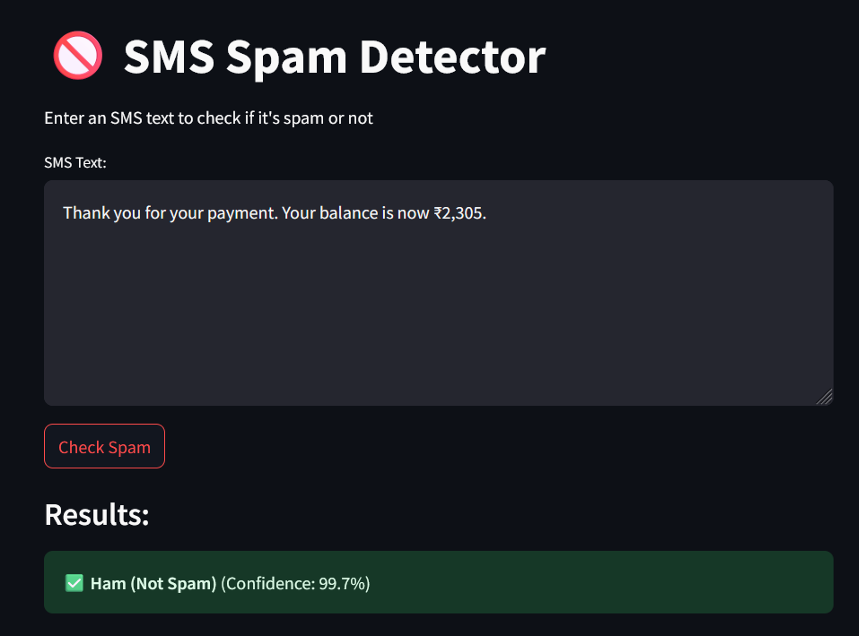
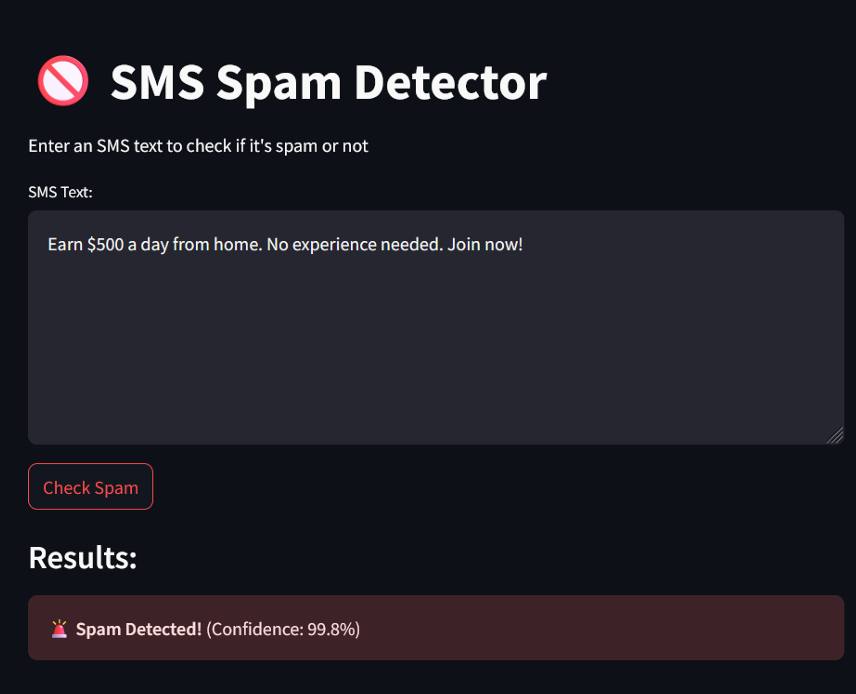

# 📱 SMS Spam Detection

This project focuses on detecting spam messages in SMS texts using two different approaches: a **Baseline Machine Learning approach** and an **Advanced Deep Learning approach with BERT**.

## Dataset

- **Source:** [Kaggle](https://www.kaggle.com/datasets/uciml/sms-spam-collection-dataset)  
We used a dataset of SMS messages labeled as **ham (not spam)** or **spam**.  
One challenge we faced was that the dataset was **imbalanced**, meaning there were more ham messages than spam ones.

## 🔹 Baseline Approach (Traditional Machine Learning)

In this method, we followed these steps:

### Preprocessing
- **Text Normalization**
- **Lowercasing**
- **Removing special characters**

### Text Vectorization
We used **TF-IDF** to convert text into numerical features that machine learning models can understand.

### Models Used
- **Logistic Regression (LR)**
- **Gaussian Naive Bayes (GNB)**
- **Random Forest (RF)**

### Handling Imbalanced Data
We used **SMOTE** (Synthetic Minority Oversampling Technique) after applying TF-IDF to balance the data.

## 🔸 Advanced Approach (Deep Learning with BERT)

In this approach, we used **BERT**, a powerful language model from Google that understands the context of words in a sentence.

### Setup
- **Model:** BERT (pretrained version)
- **Libraries:** Hugging Face Transformers, PyTorch

### Handling Imbalanced Data
Instead of SMOTE, we used **class weights in the loss function** to give more importance to the minority class (spam).

## 🖥️ Interface

We also built a simple interface to test the model using Streamlit.
Users can input an SMS message and get a prediction: **Spam** or **Ham**.

## What We Learned

- The **difference** between traditional ML and advanced NLP models like BERT.
- How **BERT works** and how to use it for classification tasks.
- How to **handle imbalanced datasets** using different techniques.

## Conclusion

Both approaches helped us understand the spam detection problem from different angles.  
However, the **BERT model gave the best results**, achieving an **accuracy of 99%**.  
It was especially good at understanding the context of messages, making it more powerful than traditional models in this task.
